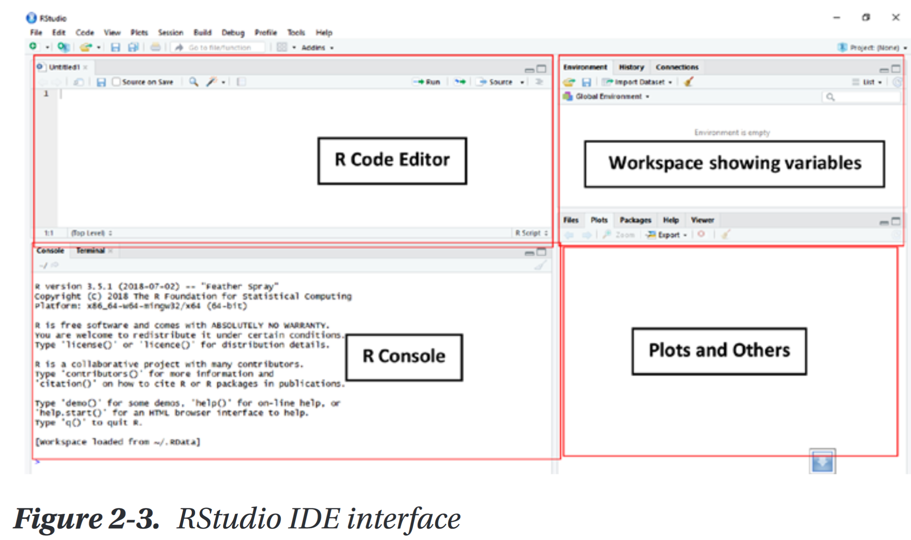

Chapter 2 & Intro Report for Book *Learn R for Applied Statistics : With
Data Visualizations, Regressions, and Statistics* (Week 1 Thursday)
================
Nurrospody
4/2/2020

  - [Notable Vocabulary](#notable-vocabulary)
  - [Notable Vocabulary from
    Introduction](#notable-vocabulary-from-introduction)
  - [Figures to keep handy](#figures-to-keep-handy)
  - [Commands Used: print(), data, summary(),
    plot()](#commands-used-print-data-summary-plot)

### Notable Vocabulary

**IDE** - Integrated Development Environment  
**GUI** - Graphical User Interface  
**CSV** - Comma-seperated Values

### Notable Vocabulary from Introduction

**R** - A programing language for statistical computing and analysis.  
**HLL** - High-level languages (like R) are programing languages made to
‘make sense’ to humans, but take more time for a computer to process.  
**LLL** - Low-level languages are computer-language based programing
languages. They are less intuitive to use, but faster to excecute.  
**Statistics** - A collection of mathematics that deals with the
organization of, analysis of, and interpretation of data. Descriptive,
inferential, regressions analysis: types of statistics.  
**Data science** - Statistics+computer science+machine learning+buisness
expertise  
**Data mining** - Identifying patterns from numeric information  
**Data text mining** - Identifying patterns from text-based information.
This requires techniques like text classification; text clustering;
part-of-speech tagging; sentiment analysis.  
**NLP** - Natural language processing - data text mining requires this;
machine learning that halps with recognizing human language text based
patterns.  
**Big Data** - Data that’s too big and complex for a computer to process
on its own. Volume of data; speed of data coming in (velocity); variety
of techniques required to analyze the data properly; make data big
data.  
**Descriptive analytics** :: descriptive statistics  
**Predictive analytics** :: inferential statistics  
**Perscriptive analytics** :: using and applying inferential statistics

### Figures to keep handy

 This figure shows the placement of the R
Code Editor (toedp left corner), Workspace Showing Variables (top
right), R Console (bottom left), Plots and Others (bottom right). It is
on page 22 of *Title:Learn R for Applied Statistics* in the RStudio: The
IRE for R section.

### Commands Used: print(), data, summary(), plot()

The **print() function** is the first function introduced in Chapter 2.
I printed the text “Hello World”, and also experimented with being able
to print any other text by talking about my squeaky doorhinge. Use of
this function has not yet been explained in R, but if I remember
correctly, when using Kali Linux the print() function (or whatever its
equivilant is) is important so that you can select what was printed and
further use it in command line.

``` r
print("Hello World");
```

    ## [1] "Hello World"

``` r
print("The doorhinge for our room is really squeaky and loud");
```

    ## [1] "The doorhinge for our room is really squeaky and loud"

The book wanted me to use a data set called MyData to see **output of
all the data; summary of the data; and a plot of the data** . . . I do
not have a .csv file named myData in my directory, however I DO have
cars data that comes automatically from creating an Rmarkdown type file
so I used that data to experiment with listing all the data; giving a
summary of the data; and plotting the data. If I typed into the R Code
Editor, I needed to highlight the command and use Run; if I typed it
into the R Console, I simply need to press Enter on my keyboard. The
plot() command makes a plot appear in the Plots and Others section,
wheras naming the dataset and using the summary() command makes the
information appear in the R Console.

``` r
cars
```

    ##    speed dist
    ## 1      4    2
    ## 2      4   10
    ## 3      7    4
    ## 4      7   22
    ## 5      8   16
    ## 6      9   10
    ## 7     10   18
    ## 8     10   26
    ## 9     10   34
    ## 10    11   17
    ## 11    11   28
    ## 12    12   14
    ## 13    12   20
    ## 14    12   24
    ## 15    12   28
    ## 16    13   26
    ## 17    13   34
    ## 18    13   34
    ## 19    13   46
    ## 20    14   26
    ## 21    14   36
    ## 22    14   60
    ## 23    14   80
    ## 24    15   20
    ## 25    15   26
    ## 26    15   54
    ## 27    16   32
    ## 28    16   40
    ## 29    17   32
    ## 30    17   40
    ## 31    17   50
    ## 32    18   42
    ## 33    18   56
    ## 34    18   76
    ## 35    18   84
    ## 36    19   36
    ## 37    19   46
    ## 38    19   68
    ## 39    20   32
    ## 40    20   48
    ## 41    20   52
    ## 42    20   56
    ## 43    20   64
    ## 44    22   66
    ## 45    23   54
    ## 46    24   70
    ## 47    24   92
    ## 48    24   93
    ## 49    24  120
    ## 50    25   85

``` r
summary(cars)
```

    ##      speed           dist       
    ##  Min.   : 4.0   Min.   :  2.00  
    ##  1st Qu.:12.0   1st Qu.: 26.00  
    ##  Median :15.0   Median : 36.00  
    ##  Mean   :15.4   Mean   : 42.98  
    ##  3rd Qu.:19.0   3rd Qu.: 56.00  
    ##  Max.   :25.0   Max.   :120.00

``` r
plot(cars)
```

<!-- -->

Chapter 2 also familiarized me with the **History tab** in Workspace; if
I double click on something in the workspace, it will appear in the R
Console, and then I can press Enter to run it.

I typed this report as an Rmd (R Markdown) file within the R Code
Editor.
